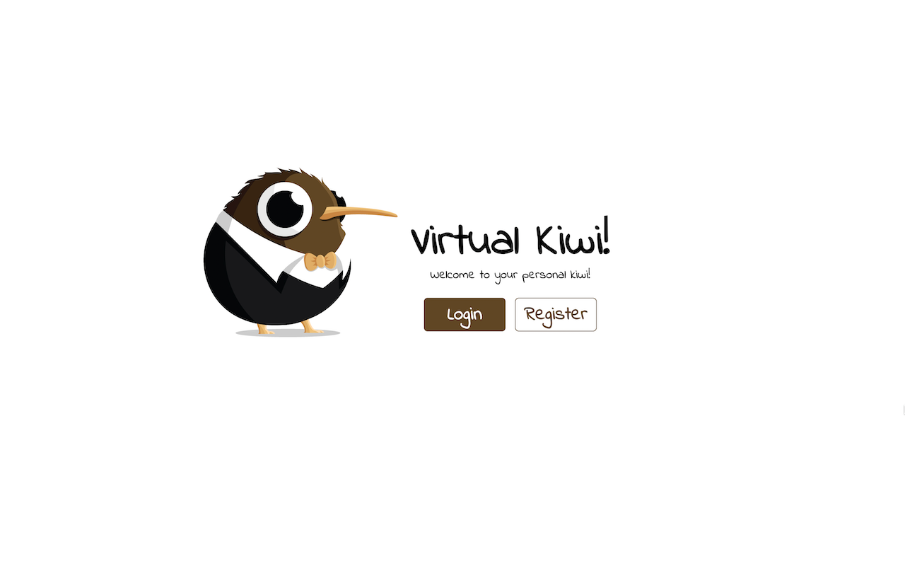
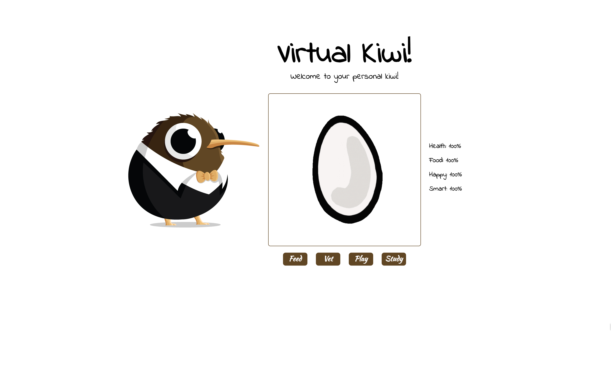
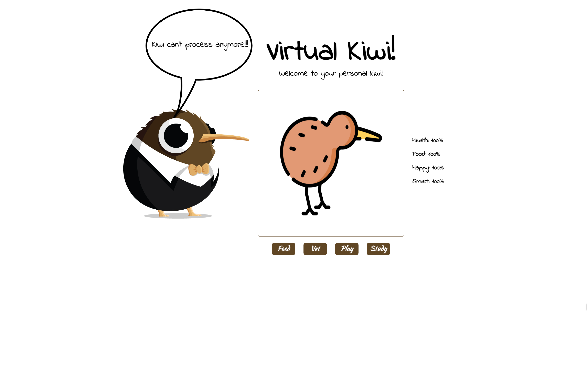
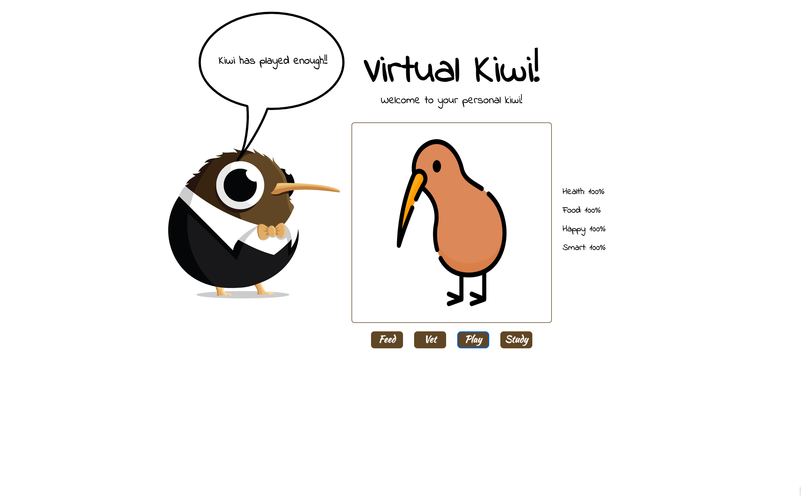
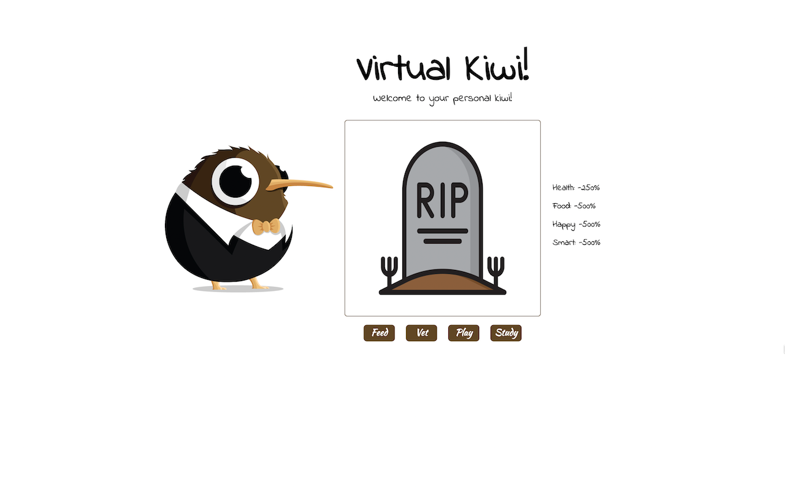

# VITUAL KIWI - Your personal virtual pet



---

## The App:

Kiwi is a bird that requires a lot of attention during his entire life-span, just like the real pet would. This app allows a registered user to care for and raise their own Kiwi, by feeding and playing, taking him to the vet occasionally, and of course helping him with homework. Kiwi grows every 24 hours, but its needs happen throughout the day and must be met otherwise kiwi passes.

---






---

## The Story:

As a collaboration/contribution initiative, a team of 1 backend, 1 UI/UX, 1 frontend, and 1 scrum master got together to tackle a random project. The chosen project was a virtual pet with the original tamagotchi (own zero rights) as example, to be made in 1 week.

In spite of the difference in timezones, holidays, and other difficulties along the way, the MVP is here.

### TECH

- Client: ReactJS, CSS
- Server: NodeJS, ExpressJS
- Database: MongoDB
- SCRUM: Github Projects

### Running it

- Fork this project and clone it
- Run `npm install` on the root
- Run `npm run dev` to start the server
- On a second terminal, run `cd client` and then `npm install` to install the client dependencies
- Then run `npm start` and go to localhost:3000

### ENV

```
TOKEN_SECRET=chooseYourStringWithoutQuotes
DB_URI=mongodb+srv://YOUR: CREDENTIALS!@YOURCLUSTER.xxkohq.mongodb.net/YOURDB

```
